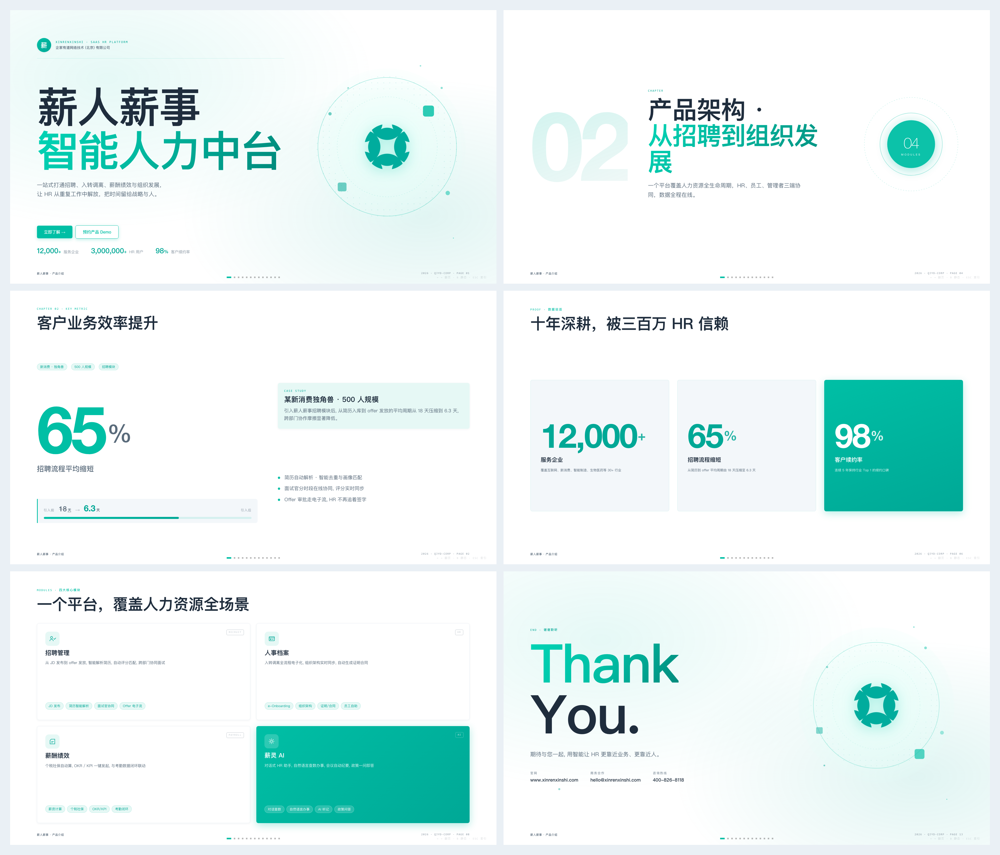
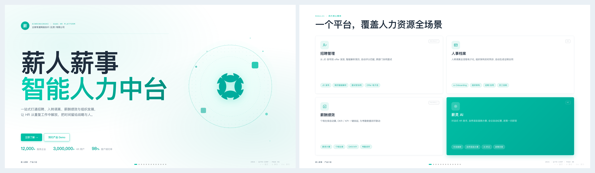
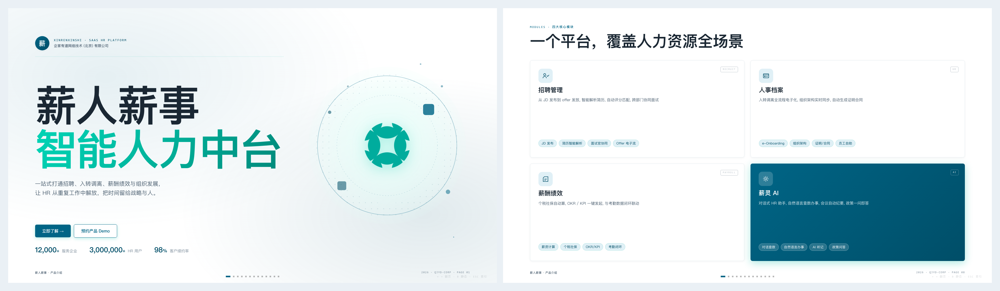
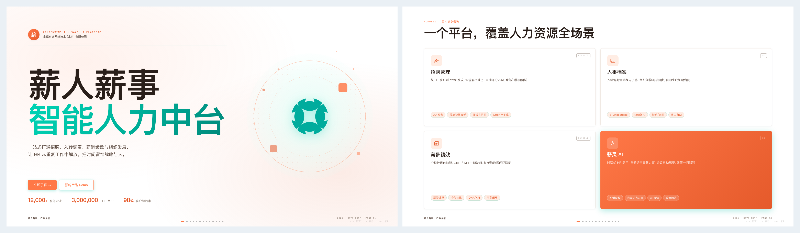
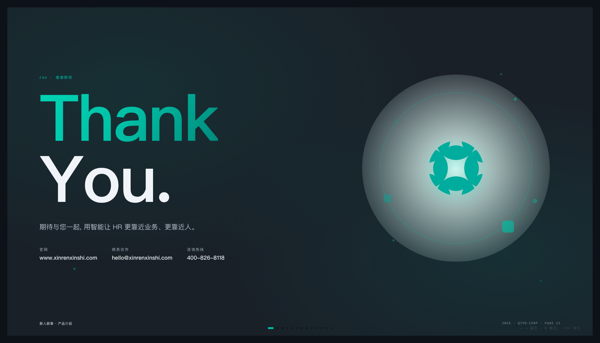

# ang-ppt-skill · 网页 PPT / 配图 / 封面


> 🌏 **English version: [README.en.md](./README.en.md)**

一个适配 Claude Code / Codex 等 Agent 环境的网页 PPT 技能，用于生成**单文件 HTML 横向翻页 PPT**、PPT 配图和多平台封面。

内置三套视觉系统：

- **Style A：电子杂志 × 电子墨水**。像 *Monocle* 贴上了代码，适合叙事、观点、分享、个人风格表达。
- **Style B：瑞士国际主义**。网格至上、单一高饱和锚点色、直角、发丝线、极致字号对比，适合事实、产品、分析、方法论表达。
- **Style C：企家有道企业风 / qjyd-corp**。圆角企业 SaaS 美学(8px 圆角 + 弱阴影 + SVG 几何浮动)、海洋青主色、系统字体优先，适合 B 端 SaaS 产品介绍、商务提案、客户案例、销售面客演示；配套 13 个 `C01-C13` 锁定版式和默认薪人薪事 logo。

> 本 skill 基于 [op7418/guizang-ppt-skill](https://github.com/op7418/guizang-ppt-skill)(AGPL-3.0)二次开发，在原有 Style A 电子杂志风、Style B 瑞士国际主义风之上，新增了 Style C 企家有道企业风(qjyd-corp)以及一些工程化改造。

**旧主题 · Style A 电子杂志风**


**新主题 · Style B 瑞士国际主义**


**新主题 · Style C 企家有道企业风(qjyd-corp / B 端 SaaS)**




## Prerequisites · 装机清单

### 必需

- **Node.js ≥ 18**(macOS 用 Codex.app 时其内置的 `cua_node` 已自带，无需额外装)
- **现代浏览器**(Chrome / Edge / Safari ≥ 16 任选其一，推荐 Chrome 演示时帧率最稳)
- **网络可访问 Google Fonts CDN**(仅 Style A / Style B 需要；**Style C 走系统字体，在内网/弱网环境最稳**)

### 强烈建议(没有的话视觉核对会瘸腿)

- **Playwright + Chromium headless shell**(供 AI 在生成 PPT 后批量截图自检)

  AI 在 `mcp__node_repl-js` 中通过 Codex 内嵌的 playwright(`/Applications/Codex.app/Contents/Resources/cua_node/lib/node_modules/playwright`)调用浏览器。**首次需要下载 Chromium headless shell ≈ 94 MiB**。可以让 AI 自己第一次撞墙时按 SKILL.md §4.0.1 的降级路径自动下载，也可以提前手工跑一次：

  ```bash
  /Applications/Codex.app/Contents/Resources/cua_node/bin/node \
    /Applications/Codex.app/Contents/Resources/cua_node/lib/node_modules/playwright-core/cli.js \
    install --only-shell chromium
  ```

  - 国内官方源 `cdn.playwright.dev` 通常可达，80 秒左右下完
  - 不通时设环境变量走阿里云镜像：`export PLAYWRIGHT_DOWNLOAD_HOST=https://npmmirror.com/mirrors/playwright`
  - 装不上时 AI 会 fallback 到系统 Chrome `--headless --screenshot=...`，功能等价但 WebGL 背景渲染稍弱

  > ⚠️ **chromium revision 是 Codex.app 出厂版本钉死的，不是本 skill 要求的**——只要你用 Codex 跑任何带视觉自动化的 skill(PPT / 前端 / 爬页 / PDF)都会撞同一个版本要求。skill 本身不依赖 playwright。

### 多模态视觉能力(强烈推荐)

做 PPT 这类**强视觉**任务，AI 在多个环节会需要"看图"：

| 环节 | 不带多模态会怎样 |
|---|---|
| **截图自检**(最关键) | 只能靠 grep/DOM 推断，**无法发现"图片堆到底部"、"标题被压成 1 字 1 行"、"卡片对齐错位"这类纯视觉 bug** |
| **图文混排页**(C08 / S22 / Layout 4) | 用户给截图后，需要看一眼图的主体位置和留白比例才能选对裁切策略 |
| **替换占位图为真实图** | 需要判断横/竖/方图，决定走哪个 `.qjyd-img-fit` 父容器 |
| **截图美化 / 截图再设计** | `screenshot-framing.md` 整章节都基于"能看见原截图"才能选对内置背景 |

**推荐**：用原生支持视觉的模型，如 `gpt-5.5`(Azure)、`gpt-4o`、`Claude 3.5+`、`Gemini 2.x`、`Qwen-VL`、`doubao-seed-2.0-pro`。

**退而求其次**：纯文本模型(如 `glm-5.1` / `deepseek-v4-pro`)+ vision API fallback(如 `azure-vision.py`)，能用但视觉调试细节会丢一档。

**最差**：纯文本模型且没有 vision fallback——视觉调试只能靠人，AI 这边更像"写 HTML 助手"而非"设计助手"。

### 一键最小装机清单

```bash
# 必装
brew install node                         # Node 18+，如果本机没有

# 强推：首次跑 PPT 任务时，让 AI 自动触发或手动运行
/Applications/Codex.app/Contents/Resources/cua_node/bin/node \
  /Applications/Codex.app/Contents/Resources/cua_node/lib/node_modules/playwright-core/cli.js \
  install --only-shell chromium

# 模型层：配一个原生支持视觉的模型(在 ~/.codex/config.toml 或对应 agent 设置里切)
```

---

## 30 秒开始

```bash
npx skills add https://github.com/AngChow/ang-ppt-skill --skill ang-ppt-skill
```

也可以直接把这段话发给有 shell 权限的 AI Agent：

```text
帮我安装 ang-ppt-skill。请把 https://github.com/AngChow/ang-ppt-skill 克隆到 ~/.claude/skills/ang-ppt-skill，安装完成后检查 SKILL.md、assets/、references/ 是否存在。
```

已经安装过的话，用这段话更新：

```text
帮我更新 ang-ppt-skill。请进入 ~/.claude/skills/ang-ppt-skill 执行 git pull，然后告诉我当前最新 commit。
```

安装后直接对 Agent 说：

```text
帮我基于这篇文章做一份瑞士风 PPT，控制在 7 页左右，需要 2-3 张配图。
```

也可以试这些请求：

```text
帮我把这份 Markdown 做成杂志风演讲 PPT。
基于这份 PPT 的核心观点，生成一张公众号 21:9 头图。
把这张产品截图重新设计成适合 PPT 的 16:10 配图。
```

## 效果

- 🖋 **双视觉系统**：电子杂志风负责叙事，瑞士风负责事实表达
- 📐 **横向左右翻页**：键盘 ← → / 滚轮 / 触屏滑动 / 底部圆点 / ESC 索引
- 🧩 **Style A 10 种布局**：封面、章节、数据大字报、图文、图片网格、Pipeline、对比等
- 🧱 **Style B 22 种锁定版式**：Cover、Statement、KPI Tower、Loop Diagram、Duo Compare、Image Hero、Closing Manifesto 等
- 🟢 **Style C 13 种企业版式**：Cover hero、章节封、议程目录、大数字 KPI、三段 KPI、时间轴、4 卡矩阵、图文左右、大图全屏、引言金句、对比表、团队介绍、Thank You
- 🎨 **主题色预设**：Style A 5 套电子墨水主题，Style B 4 套瑞士高饱和锚点色，Style C 4 套企业 SaaS 主题(薄荷企业 / 青墨科技 / 暖橙提案 / 深空述职)
- 🖼 **Codex 可选配图流程**：可用 GPT-Image 2.0 / GPT-M 2.0 生成纪实照片、信息图、流程图、系统关系图、UI 情景图，并按模板比例插入
- 📰 **多平台封面**：可用同一套视觉规则生成公众号 21:9、公众号分享卡 1:1、小红书 3:4、视频号横版等封面
- 📴 **低性能静态模式**：按 `B` 可关闭 WebGL / canvas 动画，让动态内容退回静态背景
- 📄 **单文件 HTML**：不需要构建、不需要服务器，浏览器直接打开

## 适合 / 不适合

**✅ 合适**：线下分享 / 行业内部讲话 / 私享会 / AI 产品发布 / demo day / 带强烈个人风格的演讲

**❌ 不合适**：大段表格数据 / 培训课件(信息密度不够)/ 需要多人协作编辑(静态 HTML)

## 常见使用场景

| 任务 | 推荐方式 |
|------|---------|
| 长文章变演讲 PPT | 先抽核心观点，再按 6-10 页节奏生成 deck |
| 方法论 / 产品分析 | 用 Style B 瑞士风，优先使用锁定版式和 21:9 主图 |
| 个人分享 / 观点表达 | 用 Style A 电子杂志风，保留更强叙事感 |
| PPT 配图 | 在 Codex 中用 GPT-Image 2.0 / GPT-M 2.0 生成照片、信息图、流程图、UI 情景图 |
| 多平台封面 | 从同一份内容生成公众号 21:9、1:1 分享卡、小红书 3:4、视频号横版封面 |
| 截图统一风格 | 把原始截图重新生成到模板需要的比例，再插入 PPT |

## 为什么是 HTML PPT

- **更适合 Agent 生成和修改**：HTML / CSS 是文本，Agent 能直接读、改、验证。
- **表现力比 Markdown 更高**：可以做精细排版、空间定位、动画、交互和响应式封面。
- **交付更轻**：单文件 HTML 可以直接打开、演示、发送、截图。
- **更容易做质量控制**：瑞士风可以用脚本校验版式、图片槽位、标题对齐和危险 SVG。
- **更适合视觉内容链路**：同一套主题能覆盖 PPT、配图、封面和截图再设计。

## 平台支持

| 平台 | 状态 | 说明 |
|------|------|------|
| Claude Code | 支持 | 原生 Skill 工作流，适合生成和迭代 HTML deck |
| Codex | 支持 | 适合生成 PPT(三种风格全覆盖)、调用图片生成能力、Playwright 浏览器视觉检查；Style C 商务提案场景在 Codex 里最顺手 |

## 安装

### 方式一：一行命令安装(推荐)

```bash
npx skills add https://github.com/AngChow/ang-ppt-skill --skill ang-ppt-skill
```

### 方式二：把下面这段话直接发给 AI

> 帮我安装 `ang-ppt-skill` 这个 Claude Code skill。请按下面步骤做：
>
> 1. 确保 `~/.claude/skills/` 目录存在(不存在就创建)
> 2. 执行 `git clone https://github.com/AngChow/ang-ppt-skill.git ~/.claude/skills/ang-ppt-skill`
> 3. 验证：`ls ~/.claude/skills/ang-ppt-skill/` 应该看到 `SKILL.md`、`assets/`、`references/` 三项
> 4. 告诉我安装好了，之后我说"做一份杂志风 PPT"之类的话就会触发这个 skill

把这段话复制粘贴给 Claude Code / Cursor / 任何有 shell 权限的 AI Agent，它会自动完成安装。

### 方式三：手动命令行

```bash
git clone https://github.com/AngChow/ang-ppt-skill.git ~/.claude/skills/ang-ppt-skill
```

### 触发方式

装好后，Claude Code 会在对话里自动发现并调用这个 skill。触发关键词：

- "帮我做一份杂志风 PPT"
- "帮我做一份瑞士风 PPT"
- "生成一个 horizontal swipe deck"
- "editorial magazine style presentation"
- "electronic ink 风格演讲 slides"
- "帮我做一份 B 端 SaaS 产品介绍 PPT"
- "薪人薪事风格的商务提案" / "做一份薪人薪事风格的 PPT" / "薪人薪事样式"
- "企家有道风格" / "企家有道企业风" / "qjyd-corp 企业风网页 PPT"
- "基于这篇文章做一张公众号 21:9 封面"
- "基于这份 PPT 生成一张 1:1 分享卡"

## 使用流程

Skill 本身是结构化工作流，Agent 会逐步引导：

1. **选择风格** — Style A 电子杂志风、Style B 瑞士国际主义，或 Style C 企家有道企业风(qjyd-corp / B 端 SaaS)
2. **需求澄清** — 7 问清单：风格、受众、时长、素材、图片/截图需求、主题色、硬约束
3. **拷贝模板** — Style A 用 `assets/template.html`，Style B 用 `assets/template-swiss.html`，Style C 用 `assets/template-corp.html`(同时把 `assets/qjyd-corp/xrxs-logo.png` 拷到项目 `images/logo.png`)
4. **填充内容** — 先做主题节奏表，再从对应 layout 骨架里挑、粘、改文案
5. **可选配图** — 在 Codex 中询问是否用 GPT-Image 2.0 / GPT-M 2.0 生成配图，再按页面比例插入
6. **自检** — 对照 `references/checklist.md`，P0 级问题必须全过；瑞士风还要运行版式校验器
7. **预览** — 浏览器直接打开
8. **迭代** — inline style 改字号/高度/间距

详细说明见 [`SKILL.md`](./SKILL.md)。

## Style B 瑞士风

瑞士风是这次新增的结构化主题。它不是"换一套 CSS"，而是一套更严格的版式系统。

- **22 个具名版式**：正文页只能从 `S01` 到 `S22` 中选择，不能临时发明页面结构
- **4 套锚点色**：克莱因蓝 IKB、柠檬黄、柠檬绿、安全橙
- **网格锁定**：16 列 grid、直角色块、1px 发丝线、无阴影、无渐变、无圆角
- **中文字号收敛**：全中文大标题需要降一档，避免占掉正文和图片空间
- **图文底对齐**：左文右图 / 左图右文场景优先让正文块与图片底部对齐，同时避开页脚翻页组件
- **图片槽位绑定**：图片必须进入模板预留的 `data-image-slot`，常见主图按 21:9 或 16:10 生成
- **强校验**：用脚本拦住居中标题、实验版式、SVG 内写字、图片脱离槽位等问题

瑞士风校验命令：

```bash
node scripts/validate-swiss-deck.mjs path/to/index.html
```

## Style C 企家有道企业风(qjyd-corp / B 端 SaaS)

Style C 是面向 B 端商务场景的"企业 SaaS 美学"，**默认产品锚定为薪人薪事**(海洋青 `#00BFA5` + 默认 logo `assets/qjyd-corp/xrxs-logo.png`)，也支持替换为其他企业 logo 与品牌主色。

- **13 个具名版式**：`C01` 封面 hero / `C02` 章节封 / `C03` 议程目录 / `C04` 大数字 KPI / `C05` 三段 KPI / `C06` 时间轴 / `C07` 4 卡矩阵 / `C08` 图文左右 / `C09` 大图全屏 / `C10` 引言金句 / `C11` 数据对比表 / `C12` 团队介绍 / `C13` Thank You
- **4 套主题色**：🌿 薄荷企业(默认 / 通用) · 🌊 青墨科技(技术分享) · 🌅 暖橙提案(销售提案) · 🌌 深空述职(职级评审 / 述职 / 反色主题)
- **圆角企业 SaaS 美学**：8px 卡片圆角 + 弱阴影 + SVG 几何浮动装饰，**没有** WebGL 背景(渲染开销低，会议室投屏更稳)
- **系统字体优先**：PingFang SC + Helvetica Neue，无 Google Fonts CDN 依赖，内网/弱网环境最稳
- **默认 logo 槽位**：封面 C01 右侧、Thank You C13 右侧默认走 `./images/logo.png`，加载失败回退到 SKILL 内置的 `xrxs-logo.png`(薪人薪事 logo，512×512 透明 PNG)
- **图片占位 vs 真实图分离**：模板默认放 `.qjyd-img-placeholder`(成品级占位)，用户给图后整块替换为 ``
- **强红线**：17 条生成红线写在 `SKILL.md` 中，涵盖容器对齐、入场动效、图片父子契约、accent 色一致性等；qjyd-corp 不支持像 Style B 那样的脚本校验，但所有 `<section>` 都必须带 `data-layout="Cxx"`

适合场景：**SaaS 产品介绍 / 商务提案 / 客户案例 / 销售面客演示 / 团队周报 / 季度业绩汇报**。

不适合场景：艺术、文学、文化类内容(请用 Style A)；信息驱动设计 / 数据汇报方法论(请用 Style B)。

## Codex 配图能力

在 Codex 环境中，完成 deck 初稿后可以主动询问用户是否需要生成配图。用户确认后，再询问图片类型或风格，常用类型包括：

- 人文纪实照片：富士 / 徕卡感的真实场景，增加人文表现力
- 信息图 / 流程图 / 对比图 / 系统关系图：用于解释无法用实拍照片说明的概念
- 截图美化 / 截图再设计：原始截图优先用内置背景资产做 CleanShot X 式背景画布适配；需要重构时再生成 UI 情景图
- 数据大字报 / 数据图表：把关键数字做成可直接插入 PPT 的视觉素材
- 多图拼贴：用于极宽图片槽位，避免把三张 16:9 图片硬塞进三列

生成图片时要遵守四个关键规则：

- 图片是 PPT 中的嵌入素材，不要自带页脚、页底、标题、角标、页码或装饰边框
- 图片语言跟随 deck 语言：中文 deck 的信息图用中文标签，英文 deck 用英文标签
- 图片比例必须先匹配落位：瑞士风主图常用 21:9，通用主图常用 16:9 / 16:10，截图再设计常用 16:10，多图网格统一高度
- 用户截图需要保真时，先读 `references/screenshot-framing.md`，用 `assets/screenshot-backgrounds/` 内置背景 + 程序化缩放/留边/对齐处理，不要默认重画截图内容

配图提示词见 [`references/image-prompts.md`](./references/image-prompts.md)，截图适配见 [`references/screenshot-framing.md`](./references/screenshot-framing.md)。

## 封面生成

这个 Skill 也可以基于文章或 PPT 核心观点生成平台封面。典型规格：

- **公众号头图**：21:9，主标题优先，右侧或边缘保留视觉锚点
- **公众号分享卡**：1:1，与头图共用主题色、关键词和视觉元素
- **小红书封面 / 轮播**：3:4，大标题优先，多张时统一字号和视觉节奏
- **视频号 / 横版封面**：16:9，适合标题 + 副标题 + 单一视觉焦点

封面原则和 PPT 一样：只用少量关键词，视觉重心落在大标题上，不要把正文堆满。

## 示例请求

复制下面任意一条给 Agent，再附上你的文章、Markdown 或素材文件：

```text
帮我基于这篇文章生成一份 8 页左右的瑞士风 PPT，需要 3 张配图，图片比例跟模板槽位匹配。
```

```text
帮我把这个产品分析文档做成电子杂志风 PPT，重点突出观点和叙事节奏。
```

```text
基于这份 PPT 的主题，做两张封面：公众号 21:9 头图和 1:1 分享卡，视觉保持一致。
```

```text
把这些产品截图重新设计成统一的 16:10 PPT 配图，保留关键信息，不要画页脚和标题。
```

## 目录结构

```
ang-ppt-skill/
├── SKILL.md              ← Skill 主文件：工作流、原则、常见错误
├── README.md             ← 本文件
├── assets/
│   ├── template.html         ← Style A 电子杂志风模板
│   ├── template-swiss.html   ← Style B 瑞士国际主义模板
│   ├── template-corp.html    ← Style C 企家有道企业风模板(qjyd-corp / B 端 SaaS)
│   ├── qjyd-corp/            ← Style C 专属资产
│   │   ├── xrxs-logo.png     ← 默认产品 logo(薪人薪事，封面/Thank You 默认用这个)
│   │   └── c08-xinling.jpg   ← C08 模板演示图(只是模板样本，不要复制到生成项目)
│   ├── motion.min.js         ← Motion One 本地副本(离线兜底，3 套风格共享)
│   └── screenshot-backgrounds/ ← 截图美化内置背景(WebP)：style-a 5 套 / style-b 4 套
├── scripts/
│   └── validate-swiss-deck.mjs ← 瑞士风版式校验器(qjyd-corp 沿用，只校验 data-layout)
└── references/
    ├── components.md     ← 组件手册(字体、色、网格、图标、callout、stat、pipeline)
    ├── layouts.md        ← Style A · 10 种页面布局骨架(可直接粘贴)
    ├── layouts-swiss.md  ← Style B · 22 种瑞士风锁定版式
    ├── layouts-corp.md   ← Style C · 13 种企业风锁定版式
    ├── swiss-layout-lock.md ← 瑞士风还原度和版式硬约束
    ├── swiss-map-component.md ← Style B · S08 地图扩展组件(MapLibre)
    ├── themes.md         ← Style A · 5 套主题色预设(只能选不能自定义)
    ├── themes-swiss.md   ← Style B · 4 套瑞士风锚点色
    ├── themes-corp.md    ← Style C · 4 套企业 SaaS 主题色
    ├── image-prompts.md  ← GPT-Image 2.0 / GPT-M 2.0 配图类型、比例和基础提示词
    ├── screenshot-framing.md ← CleanShot X 式截图适配语义
    └── checklist.md      ← 质量检查清单(P0 / P1 / P2 / P3 分级)
```

## 主题色预设

从 `references/themes.md` 里选一套——**不允许自定义 hex 值**，保护美学比给自由更重要。

### Style A 电子杂志主题

| 预览 | 主题 | 核心色与适合场景 |
|------|------|------------------|
|  | 🖋 **墨水经典** | `#0a0a0b` / `#f1efea`。通用默认、商业发布、不知道选啥时最稳。 |
|  | 🌊 **靛蓝瓷** | `#0a1f3d` / `#f1f3f5`。科技、研究、AI、技术发布会。 |
|  | 🌿 **森林墨** | `#1a2e1f` / `#f5f1e8`。自然、可持续、文化、非虚构内容。 |
|  | 🍂 **牛皮纸** | `#2a1e13` / `#eedfc7`。怀旧、人文、阅读、历史、文学分享。 |
|  | 🌙 **沙丘** | `#1f1a14` / `#f0e6d2`。艺术、设计、创意、时尚和画廊感内容。 |

切换主题只需替换 `template.html` 开头 `:root{}` 里的 6 行变量，其他 CSS 全走 `var(--...)`。

### Style B 瑞士主题

瑞士风从 `references/themes-swiss.md` 里选一套，同样**不允许自定义 hex 值**。

| 预览 | 主题 | 锚点色与适合场景 |
|------|------|------------------|
|  | 🔵 **克莱因蓝 IKB** | `#002FA7`。通用默认、商业发布、AI 产品、方法论。 |
|  | 🟡 **柠檬黄** | `#FFD500`。年轻、运动、零售、消费品、Y2K 复古。 |
|  | 🟢 **柠檬绿** | `#C5E803`。生态、可持续、健康、Z 世代品牌。 |
|  | 🟠 **安全橙** | `#FF6B35`。警示、新闻、工业、运动、活力主题。 |

如果用户说"瑞士风 PPT"但没有指定颜色，默认推荐克莱因蓝 IKB。

### Style C 企家有道企业主题(qjyd-corp)

Style C 从 `references/themes-corp.md` 里选一套，**不允许自定义 hex 值**。一份 deck **只能用一套主题**，不允许中途换 accent。

| 预览 | 主题 | 锚点色与适合场景 |
|------|------|------------------|
|  | 🌿 **薄荷企业(默认)** | `#00BFA5` 海洋青(薪人薪事自家色)。通用 / 销售面客 / 商务提案 / 客户对接。**不知道选啥时的默认。** |
|  | 🌊 **青墨科技** | ⚠️ 当前主题样式细节尚未充分调优，整体效果不如默认薄荷主题成熟，**暂不建议生产使用**。 `#006586` 深青墨。技术分享 / 数据汇报 / 研发对外讲产品架构 / B 端技术 demo。 |
|  | 🌅 **暖橙提案** | ⚠️ 当前主题样式细节尚未充分调优，整体效果不如默认薄荷主题成熟，**暂不建议生产使用**。 `#FF7847` 暖橙朱红。销售提案 / 增长汇报 / 营销活动方案 / 客户案例集。 |
|  | 🌌 **深空述职** | ⚠️ 当前主题样式细节尚未充分调优，整体效果不如默认薄荷主题成熟，**暂不建议生产使用**。 `#1A2028` 深空蓝灰 + `#00BFA5` 薄荷点缀。**唯一一个默认 dark 主底**主题——职级评审 / 个人述职 / 团队复盘 / 年终总结。 |

如果用户说"企业风 PPT"、"商务提案"或"薪人薪事风格"但没指定颜色，默认推荐 🌿 薄荷企业。

> 💡 替换为非薪人薪事的 logo 时，把目标项目里的 `images/logo.png` 换掉即可，模板的 `onerror` 兜底会自动 fallback 到 SKILL 内置 logo，不会破图；但建议同时改 themes-corp.md 的 accent 色对齐你的品牌色。

## 核心设计原则

1. **克制优于炫技** — WebGL 背景只在 hero 页透出
2. **结构优于装饰** — 信息靠字号 + 字体对比 + 网格留白，不用阴影和浮动卡片
3. **图片是第一公民** — 图片要对齐正文内容区，比例稳定，只裁底部，顶部和左右完整
4. **配图只做素材** — 生成图只保留核心照片 / 图表 / UI，不要把 PPT 页脚、标题和角标画进图片里
5. **节奏靠 hero 页** — hero / non-hero 交替，才不累眼睛
6. **低性能可退场** — 按 `B` 能切换到静态模式，动态效果不能成为阅读负担
7. **术语统一** — Skills 就是 Skills，不中英混译
8. **瑞士风必须守版式** — Style B 优先还原原始 22P 版式，不要为了"多样"发明不存在的页面
9. **企业风一份 deck 一套主题** — Style C 不允许中途换 accent；模板默认放 `.qjyd-img-placeholder` 占位，有真实图时整块替换为 ``，不要嵌套
10. **企业风 logo 槽位是品牌位，不是装饰位** — Style C 封面 / Thank You 的 logo 走 `./images/logo.png`(默认 = 薪人薪事)，不要替换成手画 SVG 几何冒充

## 视觉参考

- [*Monocle*](https://monocle.com) 杂志的版式
- YC Garry Tan "Thin Harness, Fat Skills"
- Massimo Vignelli / Helvetica Forever / 瑞士国际主义网格系统
- Notion / Linear / Stripe 的企业版官网(Style C 锚点)
- 薪人薪事产品 UI(Style C 默认主题色基线)

## Roadmap

- 补充更多真实案例和可打开的 HTML deck 示例
- 扩展封面规格，覆盖更多内容平台
- 增加更多瑞士风版式校验规则
- 优化截图再设计和信息图生成工作流
- 整理 WorkBuddy 等平台上架版本
- 增加更多主题包，但继续限制自定义颜色
- Style C 增加更多企业版式(产品定价对比、客户旅程地图、行业 benchmark)
- Style C 适配更多企业 logo / 品牌主色组合，做成 `themes-corp.md` 的扩展包

## FAQ

**可以导出 PPTX 吗?**
当前核心交付是 HTML。你可以用浏览器演示、截图或录屏。如果需要 PPTX，建议把 HTML 页面作为视觉稿再转换，但这不是当前主流程。

**为什么不允许自定义颜色?**
这个 Skill 的重点是稳定产出。自由选色很容易破坏整体风格，所以只允许从预设主题里选。

**我能加自己的版式吗?**
可以。Style A 可以在 `references/layouts.md` 里扩展；Style B 更严格，需要同步更新 `template-swiss.html`、`layouts-swiss.md`、`swiss-layout-lock.md` 和校验器。

**Codex 配图是必须的吗?**
不是。没有配图也能生成 PPT。配图流程只在需要照片、信息图、UI 情景图或封面时使用。

**怎么更新到最新版?**
重新运行安装命令，或在本地 skill 目录执行 `git pull`。

**Style C 的默认 logo 是薪人薪事，我做别家产品 PPT 怎么办?**
直接在目标项目的 `images/logo.png` 放你自己的产品 logo 即可，模板会优先加载 `./images/logo.png`，加载失败时才 fallback 到 SKILL 内置的薪人薪事 logo，不会破图。同时建议改一下 `themes-corp.md` 的 `--accent` 色对齐你的品牌色——但只能从 4 套预设里选，不接受自定义 hex(美学保护机制)。

**为什么 Style C 不像 Style B 那样有强校验脚本?**
Style C 的版式表达比 Style B 更灵活(C04/C07/C08 都允许卡片/chip 自由组合)，硬规则主要靠 SKILL.md 中的 17 条红线和 `layouts-corp.md` 的"2026-06 更新一~六"做工程化沉淀。`validate-swiss-deck.mjs` 也兼容 qjyd-corp，只校验每页都带了 `data-layout="Cxx"`。

**首次截图自检报"chromium_headless_shell-XXXX 不存在"怎么办?**
这是 Codex.app 自带 playwright 的浏览器二进制还没下载，跟 skill 无关。按 [Prerequisites · 装机清单](#prerequisites-装机清单) 跑一次 install 即可，~94 MiB，80 秒搞定。

## 贡献

Bug、排版问题、新布局需求——欢迎开 Issue 或 PR。改动请优先：

- 在 `template.html` 里补类，不要让 layouts.md 使用未定义的类
- 在 `template-swiss.html` 里补类时，同步更新 `layouts-swiss.md` 和 `swiss-layout-lock.md`
- 瑞士风新增规则后，同步更新 `scripts/validate-swiss-deck.mjs`
- 把踩过的坑写到 `checklist.md` 对应的 P0 / P1 / P2 / P3 级别
- 新主题色进 `themes.md` 并给出适合的场景

## License

AGPL-3.0 © 2026 [op7418](https://github.com/op7418), with modifications by [AngChow](https://github.com/AngChow)
